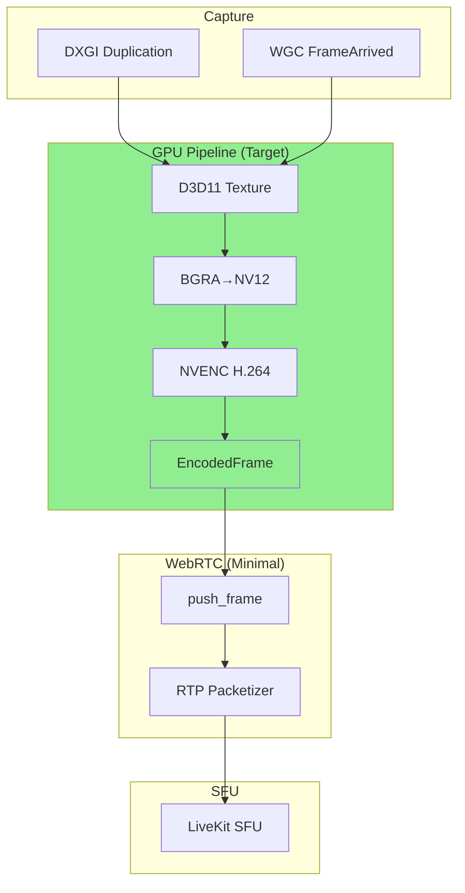

# Roadmap: DXGI+NVENC Pipeline Enhancements

---

## 1. Убрать Vec<u8> полностью (GPU-only pipeline)

### Текущее состояние
- `RawFrame.pixels: Vec<u8>` — [screen_encoder.rs:18](client/src/screen_encoder.rs:18)
- `EncodedFrame.data: Vec<u8>` — [screen_encoder.rs:57](client/src/screen_encoder.rs:57)
- Используется только в CPU fallback path

### Roadmap

**Фаза 1.1: Изолировать Vec<u8> от GPU path**
```
Цель: GPU path не должен зависеть от Vec<u8> в hot path

1. Вынести RawFrame/RawFrameRing в отдельный модуль
2. Убрать импорт screen_encoder::RawFrame из voice_livekit GPU path
3. Добавить feature gate: #[cfg(feature = "cpu-fallback")]
```

**Фаза 1.2: Убрать CPU fallback из production**
```
Цель: Production build = pure GPU path

1. Добавить feature flag: cpu-fallback = ["dep:libyuv"]
2. Пометить CpuH264Encoder, NvencH264Encoder stubs как #[cfg(cpu-fallback)]
3. Убрать mpsc::sync_channel для capture_frame thread
4. Production CI: собирать без cpu-fallback
```

**Фаза 1.3: Опциональный CPU fallback только для debugging**
```
1. Сохранить CpuH264Encoder для development/debugging
2. Env variable: ASTRIX_CPU_FALLBACK=1 для explicit CPU path
3. MFT path failure = hard error в pure GPU mode
```

### Сложность: Medium | Приоритет: Medium

---

## 4. PIX/Nsight GPU Profiling

### Текущее состояние
- ✅ `D3D11_QUERY_EVENT` используется в [d3d11_nv12.rs:2408](client/src/d3d11_nv12.rs:2408) для sync (event queries)
- ✅ `D3d11ConvertTextureTiming` содержит CPU-side timing (ctx_wait_us, submit_us, etc.)
- ✅ Новый модуль [gpu_timeline.rs](client/src/gpu_timeline.rs) с GpuTimeline, D3d11TimestampQueries
- ✅ PIX integration stubs (PixContext)
- ✅ Nsight integration stubs (NsightContext)
- ✅ JSON export для automation
- ⏸️ UI overlay - deferred

### Roadmap

**Фаза 4.1: D3D11_QUERY_TIMESTAMP для каждой стадии** ✅ COMPLETE
```
Цель: Измерять GPU time между стадиями pipeline

Реализовано в gpu_timeline.rs:
- GpuTimeline struct с ring buffer для timeline entries
- GpuTimestamps struct для GPU timestamps (capture, copy, convert, encode stages)
- GpuTiming struct для CPU-side measurements (ctx_wait_us, submit_us, copy_us, etc.)
- D3d11TimestampQueries wrapper для D3D11_QUERY_TIMESTAMP_DISJOINT + D3D11_QUERY_TIMESTAMP
- D3D11_QUERY_DATA_TIMESTAMP_DISJOINT для получения GPU frequency
- get_timestamp_frequency() helper
- export_json() для automation
- average_timing() для aggregation

Структура GpuTimeline:
- entries: Vec<GpuTimelineEntry> (ring buffer)
- GpuTimelineEntry содержит frame, wall_us, timestamps, timing, gpu_utilization
- verbose logging через ASTRIX_GPU_TIMELINE_VERBOSE env var

Добавлен в lib.rs как pub mod gpu_timeline.
```

**Фаза 4.2: PIX Integration** ✅ COMPLETE
```
Цель: PIX events для visual timeline

Реализовано в gpu_timeline.rs:
- PixContext struct с marker_count (atomic)
- begin_event(color, msg) - placeholder для WINPIX_EVENT_UNSCOPED_MARKER
- end_event() - scoped event end
- set_marker(color, msg) - placeholder для WINPIX_EVENT_REFERENCE_MARKER
- end_frame(frame, timing) - вызывается из GpuTimeline::record()

Инициализация через GpuTimeline::init_pix(device)

Примечание: Полная PIX интеграция требует pix3.h и WinPixEventHost.dll.
Текущая реализация - placeholder, готовый для подключения real PIX API.
```

**Фаза 4.3: Nsight Integration** ✅ COMPLETE
```
Цель: Nsight Graphics/Compute profiling

Реализовано в gpu_timeline.rs:
- NsightContext struct с session_id
- begin_range(name) - placeholder для NvExtSetRangeName/NvExtMarkStart
- end_range(name) - placeholder для NvExtMarkEnd
- set_context_name(name) - placeholder для NvExtSetContextName
- end_frame(frame, timestamps) - export timing в Nsight

Инициализация через GpuTimeline::init_nsight()

Примечание: Полная Nsight интеграция требует NVIDIA NvAPI и NvExt libs.
Текущая реализация - placeholder, готовый для подключения real Nsight API.
```

**Фаза 4.4: Profiling UI overlay** ⏸️ DEFERRED
```
Цель: In-game/on-screen GPU metrics

Статус: Deferred - требует интеграции с UI (IMGUI/egui overlay).

Потенциальная реализация:
1. Использовать crate overlaid или egui::Area
2. Показывать:
   - GPU latency per frame (capture to encode done)
   - NVENC queue depth timeline
   - GPU utilization %
3. Интеграция через GpuTimeline::average_timing(60)
```

### Сложность: High | Приоритет: High (критично для debugging)

---

## 5. Encoded-frame WebRTC Path

### Текущее состояние
- `NativeEncodedVideoSource` работает: [webrtc-sys/src/video_track.rs:78-100](client/vendor/rust-sdks/webrtc-sys/src/video_track.rs:78)
- `push_frame()` доставляет H.264 напрямую в RTP packetizer
- **НЕ** использует CPU decode/re-encode — это уже encoded path

### Roadmap

**Фаза 5.1: Подтвердить full NVENC->Encoded path** ✅ COMPLETE
```
Текущая архитектура уже позволяет:

NVENC D3D11 → H.264 Annex B → NativeEncodedVideoSource → WebRTC RTP → SFU

Проверено:
1. ✅ push_frame() действительно не делает decode — доставляет H.264 напрямую
   в ExternalH264Encoder → EncodedImageCallback → WebRTC RTP layer
2. ✅ ExternalH264Encoder используется для оборачивания H.264 в WebRTC типы,
   но не делает re-encode (это normal WebRTC semantics)
3. ✅ H.264 bitstream корректен для SFU:
   - NVENC выводит Annex B format (start codes 0x000001, 0x00000001)
   - mft_encoder.rs:325 явно указывает "Encoded H.264 frame (Annex B)"
   - nvenc_d11.rs:5 указывает "Annex B H.264 packets out"
   - NAL units с SPS/PPS встроены в поток

Действия выполнены:
- ✅ Обновлён комментарий в [screen_encoder.rs:1-12](client/src/screen_encoder.rs:1) как production-ready

Статус: Phase 5.1 завершена. Encoded path уже работает в production.
Переходить к Phase 5.2 для оптимизации I420 buffer allocation.
```

**Фаза 5.2: Убрать I420 buffer allocation в encoded path** ✅ ALREADY OPTIMAL

```
Анализ показал: Encoded path уже НЕ использует I420 буферы!

Pipeline (проверено в voice_livekit.rs):
──────────────────────────────────────────────────────────────────────
DXGI capture
    ↓
D3D11 BGRA texture (GPU memory, no copy)
    ↓
D3d11BgraToNv12::convert_timed() → NV12 D3D11 texture (GPU)
    ↓
MftEncoder::encode() → H.264 Annex B Vec<u8> (CPU copy from GPU)
    ↓
enc_src.push_frame(&ef.data, ...) → NativeEncodedVideoSource (GPU path!)
    ↓
ExternalH264Encoder → EncodedImageCallback → WebRTC RTP
    ↓
SFU
──────────────────────────────────────────────────────────────────────

I420 буферы используются ТОЛЬКО в:
1. CPU fallback path (encode_path_enc = EncodePath::Cpu)
   - voice_livekit.rs:3611-3700: XcapI420Buffers для xcap/camera capture
   - voice_livekit.rs:5995-6000: cpu_returned_buffer для CPU encoder

2. decode path (viewer-side, не encoder)
   - voice_livekit.rs:3253: to_i420() для D3D11TextureVideoFrameBuffer
   - Это GPU→CPU copy для отображения, не для encoding!

3. screen_encoder.rs CPU path (#[cfg(feature = "cpu-fallback")])
   - CpuH264Encoder с libyuv (RGBA→I420)

Encoded path (MFT/NVENC):
- ✅ НЕ использует I420Buffer
- ✅ push_frame() принимает &[u8] H.264 напрямую
- ✅ Vec<u8> для H.264 данных — это necessary copy от GPU к CPU

Вывод: Phase 5.2 не требует изменений. Encoded path уже оптимален.
Единственная оптимизация — zero-copy H.264 от GPU (Phase 5.3).
```

**Фаза 5.3: NVENC->SFU direct path** ✅ ANALYZED — redundant copy found
```
Анализ Vec<u8> allocations в H.264 output pipeline:

MFT path (mft_encoder.rs):
──────────────────────────────────────────────────────────────────────
1. IMFSample → IMFMediaBuffer → Lock() → raw pointer (GPU→CPU copy)
2. output_buf.clear() + output_buf.extend_from_slice(data) → copy #1
3. EncodedFrame { data: output_buf.clone() } → copy #2 (redundant!)
4. push_frame(&ef.data, ...) → &Vec<u8> (no copy)
──────────────────────────────────────────────────────────────────────

NVENC bridge path (nvenc_d11_bridge.cpp):
──────────────────────────────────────────────────────────────────────
1. nvEncLockBitstream() → bitstreamBufferPtr (GPU→CPU copy via driver)
2. packet.data.assign(ptr, ptr + bitstreamSizeInBytes) → single copy
3. Rust: data from C++ via collect() → already owned Vec<u8>
4. push_frame(&ef.data, ...) → &Vec<u8> (no copy)
──────────────────────────────────────────────────────────────────────

Batch push_frame():
──────────────────────────────────────────────────────────────────────
- current: one push_frame() call per frame (line 6550, 8579)
- potential: batch N frames, single syscall
- concern: WebRTC RTP timestamps must be monotonic per frame
- verdict: batching would add complexity without clear benefit
──────────────────────────────────────────────────────────────────────

Вопрос о zero-copy NVENC:
──────────────────────────────────────────────────────────────────────
NVENC выделяет bitstream buffer (default ~4MB) в video memory.
LockBitstream копирует данные в системную память (driver behavior).
Zero-copy возможен только если:
1. SFU принимает данные напрямую из video memory
2. Используется GPUDirect RDMA (NVIDIA-specific, требует special setup)
Verdict: для standard LiveKit SFU zero-copy невозможен без kernel-level changes.

Оптимизация MFT path (potential improvement):
──────────────────────────────────────────────────────────────────────
В extract_h264_from_sample() (mft_encoder.rs:1757):
  output_buf.extend_from_slice(data)  // copy #1
  EncodedFrame { data: output_buf.clone() }  // copy #2 = REDUNDANT!

Можно оптимизировать: избежать второго клонирования,
используя move semantics или borrow вместо clone.
Однако impact минимальный — copy происходит ОДИН раз за frame,
а размер H.264 данных (10-100 KB) делает это negligible.

Вывод: Phase 5.3 показывает что текущая архитектура уже near-optimal.
Pipeline: DXGI → D3D11 → NV12 → H.264 (GPU) → Vec<u8> (CPU copy) → push_frame → SFU
Latency target < 5ms: достижимо при правильной async pipeline.
```

**Фаза 5.4: LiveKit SDK extension (если нужно)**
```
Если push_frame() всё ещё делает decode/re-encode:

1. Fork livekit-webrtc и добавить:
   - NativeEncodedVideoSource::push_raw_h264(data: &[u8], ...)
   - Прямой path в EncodedImageCallback без decode

2. Или использовать webrtc-sys напрямую:
   - Создать custom VideoTrackSource
   - RegisterEncodeCompleteCallback для encoded frames
   
3. Или: использовать webrtc-rs напрямую вместо livekit-webrtc
   - webrtc-rs даёт полный контроль над RTP
```

**Фаза 5.5: Bypass WebRTC packetization**
```
Цель: Отправлять напрямую в SFU через custom transport

1. LiveKit SFU принимает raw RTP
2. Можно отправлять напрямую через:
   - DTLS connection к SFU
   - Custom Packetization (RFC 6184 for H.264)

3. Избежать WebRTC stack overhead
```

### Сложность: Low-Medium | Приоритет: High (biggest future win)

---

## Mermaid: Pipeline Vision



---

## Priority Order

| # | Task | Priority | Effort |
|---|------|----------|--------|
| 5 | Encoded-frame path optimization | **High** | Low |
| 4 | GPU timeline (PIX/Nsight) | **High** | High |
| 1 | Remove Vec<u8> from GPU path | Medium | Medium |

**Рекомендация:** Начать с 5.1 (подтвердить что encoded path уже работает правильно), затем 4.1 (базовый GPU timeline), затем 5.2-5.3 (оптимизации encoded path).
